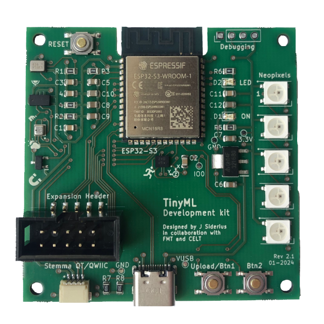
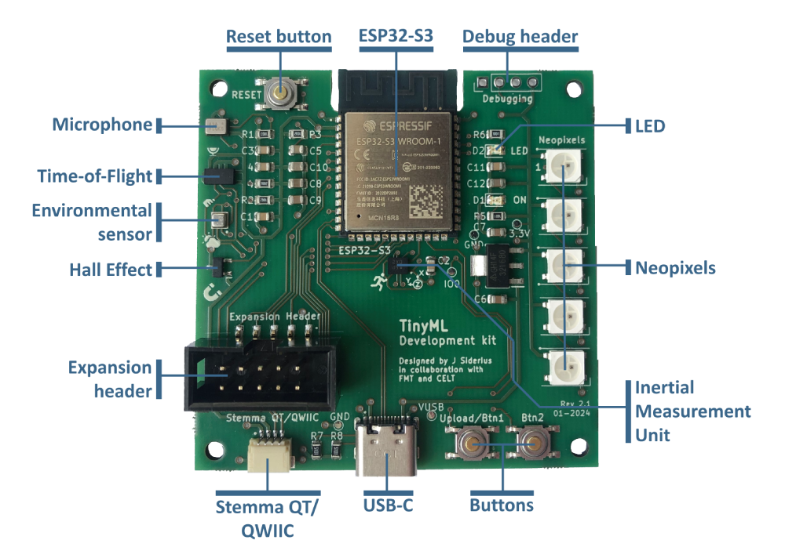
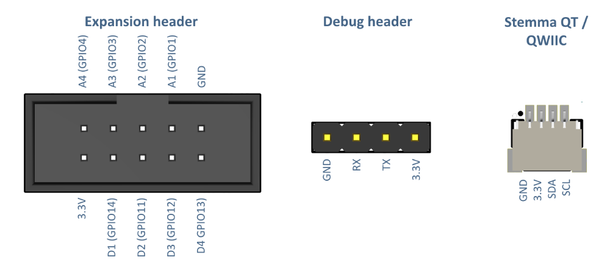
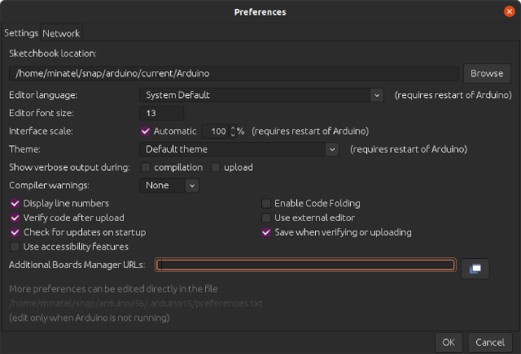
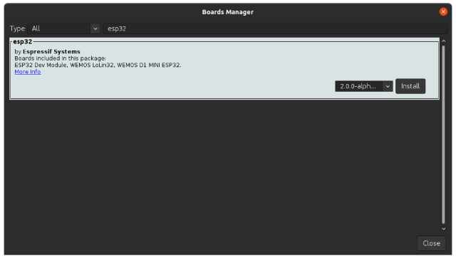
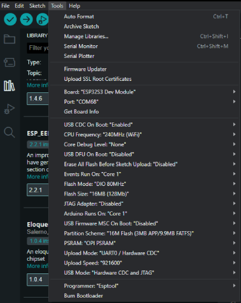
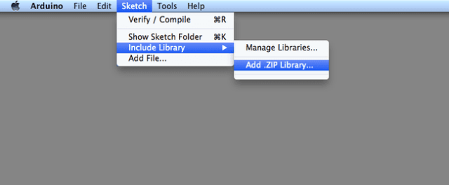

# TinyML Board Documentation


The TinyML board is a development board specifically tailored to the exploration of TinyML concepts and to test possible applications of TinyML in an easy way.
This repository documents the functionality and usage of the TinyML Board. Use the contents header below to navigate to information about the hardware, 
software, setup, examples and more.

## Contents
- [Hardware](#hardware)
  - [Sensors](#sensors)
  - [Processor](#processor)
  - [Input/Output](#inputoutput)
  - [Circuit board](#circuit-board)
- [Software](#software)
  - [Arduino](#arduino)
    - [Serial Port Setup](#serial-port-setup)
  - [Libraries](#libraries)
  - [TensorFlow Lite Micro library](#tensorflow-lite-micro-library)
  - [Uploading code](#uploading-code)
- [Code examples](#code-examples)
  - [Sensor examples](#sensor-examples)
  - [I/O examples](#io-examples)
  - [TensorFlow Lite Micro examples](#tensorflow-lite-micro-examples)
  - [Board tests](#board-tests)
- [License and contact](#license-and-contact)

## Hardware

The TinyML board contains several sensors and a powerfull processor to get you up and running with TinyML quickly. 
In the following sections, a general overview as well as technical details on all hardware can be found.

<div align="center">
    
</div>


### Sensors

The TinyML board contains five different sensors that can be used for gathering data. To see how to use all sensors, see the [Code Examples](#code-examples).
To see where all sensors are located, refer to the [Circuit Board](#circuit-board) section.

- **Microphone (I2S)** [ICS-43434](assets/datasheets/ics43434.pdf) - This sensor measures the amplitude and pitch of sound.
- **Time-of-Flight range sensor** [VL53L0X](assets/datasheets/vl53l0x.pdf) - This sensor measures short-range distance.
- **Environmental sensor** [BME280](assets/datasheets/bme280.pdf) - This sensor measures temperature, relative humidity and atmospheric pressure.
- **Hall effect magnet sensor** [AH49E](assets/datasheets/ah49e.pdf) - This sensor measures the magnetic field around its axis.
- **Inertial Measurement Unit (IMU)** [BMI270](assets/datasheets/bmi270.pdf) - This sensor measures both the angular motion using a gyroscope, as well as the acceleration using an accelerometer.

### Processor

The TinyML board is fitted with an ESP32-S3 SoC. The processor features a fast 240MHz, dual-core processor, large 16MB storage and 8MB RAM. 
Additionally, it has Bluetooth 5 and WiFi capabilities, making it easy to connect your TinyML board to the internet, for example to share sensor data.
You can learn more about the onboard chip in its datasheet: [ESP-S3-WROOM1-N16R8](assets/datasheets/esp32s3wroom1.pdf).

### Input/Output

Besides sensors, the TinyML board also contains multiple Inputs and Outputs (I/O). To see how to use all I/O, see the [Code Examples](#code-examples).

- **Buttons** - Two buttons accessible to the user (Btn1 and Btn2), which can be user-configured. Both buttons need to be pulled high by the processor (see the Code Examples).
  The last button (Reset) is used if the board needs to be programmed or debugged, e.g. if you need to restart your Tinyml board or application.
- **Output LED** - The red LED can be used as simple output, e.g. for showing if a sensor functions properly.
- **Neopixels** - The Neopixel LEDs can be addressed individually to display RGB colors. They can output application information, give users feedback and more.

- **USB-C connector** - This connector is primarily used for programming and serial communication with the TinyML board. It is also the primary power input for the board.
- **Stemma QT / QWIIC** - This connector enables users to connect extra sensors, making the TinyML board suitable for even more advanced projects.
  The connector uses the popular [Adafruit Stemma QT](https://www.adafruit.com/category/620) and [SparkFun QWIIC](https://www.sparkfun.com/categories/399) standards, opening up the possibilty for many extra sensors.
  Using a Stemma QT expansion board, users can connect even more sensors in series.
- **Expansion header** - This connector can be used to connect extra peripherals, sensors, actuators and more to adapt the TinyML board to your project.
  The connector features power, digital and analog connections, as well as support for the SPI high-speed databus. In short, the connector gives you the freedom to connect anything you can think off.
  For the pinout, refer to the [Circuit Board](#circuit-board) section

- **Miscellaneous** - The TinyML board also contains some other, miscellaneous component.
  These components are used to show power (LED ON), convert voltage, debug the TinyML board (Debugging header) and some other passive components.

### Circuit Board

Below you see a systematic overview of all hardware present on the TinyML board. For detailed information about the circuit board, refer to the [Circuit board documentation](/pcb/README.md).

<div align="center">
    
</div>

<div align="center">
    
</div></div>

## Software

In order to use the TinyML board, it needs to be correctly setup. The TinyML board requires no hardware setup. In order to start using it, connect a USB-C cable to the board and plug it into a free USB port on your system. Below sections detail the setup, through the software installation, sensor libraries and finally the TensorFlow Lite Micro setup.

### Arduino

The TinyML board can be programmed using the [Arduino IDE](https://www.arduino.cc/en/software), both the new 2.x and Legacy >1.7.x versions.
Please make sure that the Arduino IDE is installed on your system before continuing.

In order to program the TinyML board, the [ESP32](#processor) platform need to be installed. To do this, follow the steps below:

1. Open the Arduino IDE and navigate to the **Preferences** (Windows: File>Preferences, Mac: Arduino>Preferences)
2. In the field <kbd>Additional boards manager URLs:</kbd> enter the following link (If you already have other URLs in this field,
   open the full list by clicking the folder icon next to the URL):
   ```
   https://espressif.github.io/arduino-esp32/package_esp32_index.json
   ```   
3. Press <kbd>Ok</kbd> to close the **Preferences**
4. Open the **Boards Manager** by going to Tools>Boards>Boards Manager
5. Search for **ESP32** and install the platform by Espressif Systems
6. Restart the Arduino IDE

<div align="center">
    
    
</div>

For more advanced installations, for example in Platform IO, follow this [advanced installation guide](https://docs.espressif.com/projects/arduino-esp32/en/latest/installing.html).

In order to use all functions that the ESP32S3 processor has, Arduino IDE must be properly configured when programming the TinyML board. Below are the most important settings, these need to be changed in the **Settings menu** (Windows + Mac: Tools):

- **Board** - *ESP32S3 Dev Module*: This sets the correct processor and board configuration for the TinyML board. To select the ESP32 Dev Module, first select the *esp* platform.
- **Port** - *port here*: Enter the serial port of the TinyML board here. Refer to the guide [Serial Port](#serial-port-setup) to find this port.
- **USB CDC On Boot** - *Enabled*: This setting enables the onboard USB-C port to be used for serial communication.
- **Flash Size** - *16MB (128Mb)*: This setting uses the full storage of the ESP32S3, enabling space for larger projects and more code.
- **PSRAM** - *OPI PSRAM*: This setting enables the fast built-in RAM of the ESP32S3.

<div align="center">
    
</div>

#### Serial Port setup

No drivers are required for the TinyML board. However, sometimes, it is nescessary to know on which serial port the TinyML board is connected. To find this out, perform the following steps:

*Windows*
1. Open **Device Manager** by going to Start and searching for the program. (Alternatively, you can press the <kbd></kbd> key and start searching)
2. Open the **Ports (COM & LPT)** section.
3. Plug in the TinyML board and observe which COM port was added to this list.

*Mac*
1. Open the **Terminal** application by going to Applications>Utilities. (Alternatively, you can press the <kbd> + Spacebar</kbd> keys and search for Terminal)
2. Enter the following command `ls /dev/tty*` and press <kbd>Enter</kbd>.
3. Plug in the TinyML board and run the command again, observe which port was added to the list.

### Libraries

In order to use the sensors on the TinyML board, some Arduino libraries are needed. These are listed below. 

You can install the libraries through the Library Manager (Sketch>Include Library>Manage Libraries). The versions are included here for documentation purpose, the newest version of each library should work fine.

- [Adafruit BME280](https://github.com/adafruit/Adafruit_BME280_Library) (2.2.4)
- [Adafruit VL53L0X](https://github.com/adafruit/Adafruit_VL53L0X) (1.2.4)
- [SparkFun BMI270](https://github.com/sparkfun/SparkFun_BMI270_Arduino_Library) (1.0.2)
- [FastLED](https://github.com/FastLED/FastLED) (3.6.0)

The FastLED library can be replaced by any Neopixel library that supports [WS2812B](#io) addressable LEDs.

The onboard [Microphone](#sensors) uses the built-in I2S library from Espressif, you can find more information in their [I2S Peripherals documentation](https://docs.espressif.com/projects/esp-idf/en/v3.3/api-reference/peripherals/i2s.html).

### TensorFlow Lite Micro library

In order to run TensorFlow models on the TinyML board, the TensorFlow Lite Micro library needs to be setup properly. 
Included in this repository is a TensorFlow Lite Micro library specifically tailored to the ESP32 processor on the TinyML board.

The library can be downloaded as ZIP from this repository: [](/arduino-tensorflowlite-esp32/Arduino_TensorFlowLite_ESP32.zip)

To install the library, follow the steps below:

1. Download the library ZIP file from the link above.
2. Open the Arduino IDE and navigate to the **Include Library** menu. (Windows + Mac: Sketch>Include Library)
3. Click on <kbd>Add .ZIP Library...</kbd>.
4. In the file window that opens, navigate to the location where the ZIP file was downloaded.
5. Select the ZIP file and click <kbd>Open</kbd>. Wait for the Installation to finish.

<div align="center">
    
</div>

Not all normal TensorFlow Ops (layers) are supported by TensorFlow Lite Micro. In order to see what operations your TensorFlow model uses, you can upload your saved model to [Netron](https://netron.app/) and examine it. The supported operations in this version of TensorFlow Lite Micro can be found in the [Arduino-TensorFlowLite-ESP32 README](/arduino-tensorflowlite-esp32/README.md#supported-ops).

A special thanks to [Nikos Kouvaris](https://github.com/nkoub) and [Tanaka Masayuki](https://github.com/tanakamasayuki) for porting the [original Arduino_TensorFlowLite_ESP32 library](https://github.com/nkoub/Arduino_TensorFlowLite_ESP32)

> [!IMPORTANT]
> The TensorFlow Lite Micro ESP32 library included in this repository works with the TensorFlow Lite Micro release from Feb 2023.
> With much manual modifications, the library can be updated, however there is no compatibility guarantee as much of the TensorFlow Lite Micro codebase has changed without proper notice and documentation.

### Uploading code

To upload a program to the TinyML board, please follow the steps below:

1. Connect the TinyML board to your system using a USB-C cable.
2. Press the <kbd>Upload/Btn1</kbd> button. While holding the button, press and release the <kbd>RESET</kbd> button. This puts the ESP32S3 into *Download* mode.
3. In the Arduino IDE, press the <kbd>Upload</kbd> button to compile and upload your program.

## Code examples

Example code for all described functions of the TinyML board can be found below. They are divided into sensors, I/O and TensorFlow Lite Micro examples.

The TinyML board usually comes pre-programmed with a Board Test firmware. This program lets you test all functionality of the TinyML board. To start the test, just connect the TinyML board to your system and open the Serial Monitor in Arduino IDE (Windows + Mac: either through GUI or Tools>Serial Monitor).

Additional (advanced) examples can be found in the [ESP32 Arduino library documentation](https://docs.espressif.com/projects/arduino-esp32/en/latest/libraries.html).

### Sensor examples

- Microphone [](assets/example-code/tinyml-board-microphone-example/)
- Time-of-Flight sensor [](assets/example-code/tinyml-board-tof-example/)
- Environmental sensor [](assets/example-code/tinyml-board-environmental-example/)
- Hall-effect magnetic sensor [](assets/example-code/tinyml-board-halleffect-example/)
- Inertial Measurement Unit (IMU) [](assets/example-code/tinyml-board-imu-example/)

### I/O examples

- Buttons [](/assets/example-code/tinyml-board-buttons-example/)
- LED [](/assets/example-code/tinyml-board-led-example/)
- Neopixels [](/assets/example-code/tinyml-board-neopixel-example/)
- Expansion header [](/assets/example-code/tinyml-board-expansion-example/)

### TensorFlow Lite Micro examples

- TensorFlow Lite Micro sine example [](/assets/example-code/tinyml-board-tensorflowlitemicro-example/)

### Board tests

- TinyML Board Test [](/assets/example-code/tinyml-board-tests/)

## License and Contact

<span style="color:red">**TODO:**</span> License information here

<br>

**&copy; J Siderius 2024**
